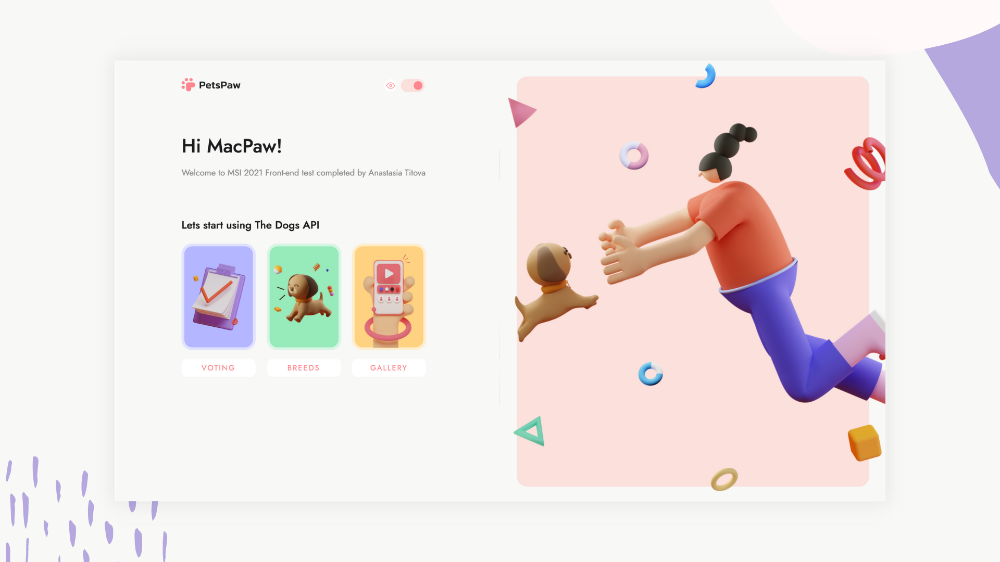

## Welcome! 👋🏼
Are you a dog lover? PetsPaw is the perfect place to explore breeds, to save your favorite pics and to share pictures of your four-legged friend.

PetsPaw app is a test task built by Anastasia Titova for MSI 2021 application. This aplication was built using React.js, Styled Components, and is based on The Dogs API. 

## More info ℹ️
All the basic requirements of the task are met as well as the following "plus" tasks:
- "go back" button works like in the browser
- there are dark & light modes and a mode switcher
- app is optimized for mobile & tablet views

## Personal Opinion 🙋🏼‍♀️
I'd like to thank MacPaw team for such an intereseting test task - clear instructions and beautiful design! I had a lot of fun while building it and, to be honest, a lot of frustration & struggle as I had to deliver functionality I've never built before. Which is awesome. I was able to understand concepts I couldn't grasp before.

This experience is exactly what I needed to enhance my frontend skills and to gain confidence. Whoever you decide to choose for the Intern Position, I'm very grateful to you. Thank you!

<!-- ## Available Scripts

In the project directory, you can run:

### `npm start`

Runs the app in the development mode.\
Open [http://localhost:3000](http://localhost:3000) to view it in the browser.

The page will reload if you make edits.\
You will also see any lint errors in the console.

### `npm test`

Launches the test runner in the interactive watch mode.\
See the section about [running tests](https://facebook.github.io/create-react-app/docs/running-tests) for more information.

### `npm build`

Builds the app for production to the `build` folder.\
It correctly bundles React in production mode and optimizes the build for the best performance.

The build is minified and the filenames include the hashes.\
Your app is ready to be deployed!

See the section about [deployment](https://facebook.github.io/create-react-app/docs/deployment) for more information.

 -->
